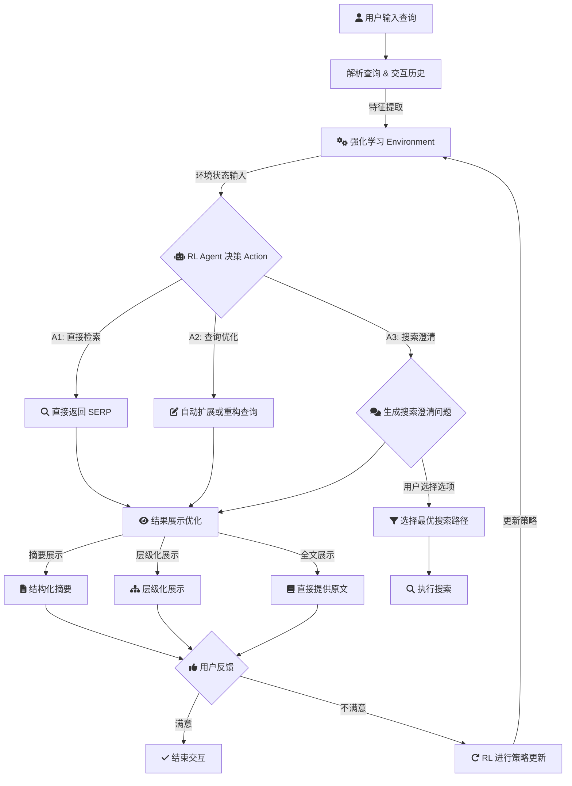

```mermaid
graph TD
    %% 用户查询输入
    A[fa:fa-user 用户输入查询] --> B[解析查询 & 交互历史]
    
    %% 强化学习环境
    B -->|特征提取| C[fa:fa-cogs 强化学习 Environment]
    
    %% RL Agent 选择最优 Action
    C -->|环境状态输入| D{fa:fa-robot RL Agent 决策 Action}
    
    %% 强化学习 Action 选择
    D -->|A1: 直接检索| E[fa:fa-search 直接返回 SERP]
    D -->|A2: 查询优化| F[fa:fa-edit 自动扩展或重构查询]
    D -->|A3: 搜索澄清| G{fa:fa-comments 生成搜索澄清问题}

    %% 结果展示优化不再是独立的，而是贯穿所有 Action
    E --> H[fa:fa-eye 结果展示优化]
    F --> H
    G --> H

    %% A3: 搜索澄清的子流程
    G -->|用户选择选项| I[fa:fa-filter 选择最优搜索路径]
    I --> J[fa:fa-search 执行搜索]

    %% A4: 结果展示优化的子流程
    H -->|摘要展示| K[fa:fa-file-alt 结构化摘要]
    H -->|层级化展示| L[fa:fa-sitemap 层级化展示]
    H -->|全文展示| M[fa:fa-book 直接提供原文]
    
    %% 最终用户反馈 & 强化学习 Reward 机制
    K --> N{fa:fa-thumbs-up 用户反馈}
    L --> N
    M --> N
    
    N -->|满意| O[fa:fa-check 结束交互]
    N -->|不满意| P[fa:fa-redo RL 进行策略更新]
    
    P -->|更新策略| C

```