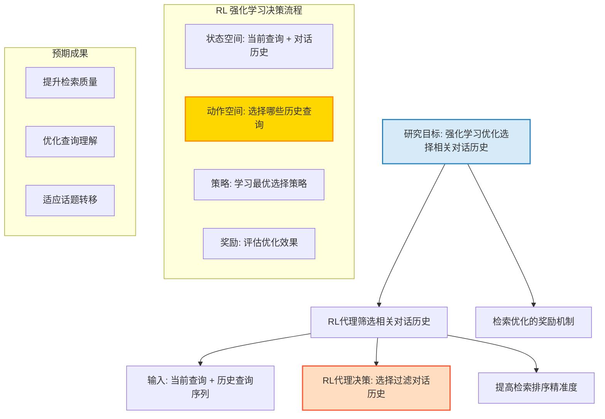

```mermaid
graph TD
  A[研究目标: 强化学习优化选择相关对话历史] --> B[RL代理筛选相关对话历史]
  A --> C[检索优化的奖励机制]

  B --> B1[输入: 当前查询 + 历史查询序列]
  B --> B2[RL代理决策: 选择过滤对话历史]

  B --> B4[提高检索排序精准度]

  subgraph RL 强化学习决策流程
  direction LR
    E1[状态空间: 当前查询 + 对话历史]
    E2[动作空间: 选择哪些历史查询]
    E3[策略: 学习最优选择策略]
    E4[奖励: 评估优化效果]
  end

  subgraph 预期成果
    direction LR
    F1[提升检索质量]
    F2[优化查询理解]
    F3[适应话题转移]
  end
  
  
  style A fill:#D6EAF8,stroke:#2E86C1,stroke-width:2px;
  style B2 fill:#FFDDC1,stroke:#FF5733,stroke-width:2px;
  style E2 fill:#FFD700,stroke:#FF8C00,stroke-width:2px;

```